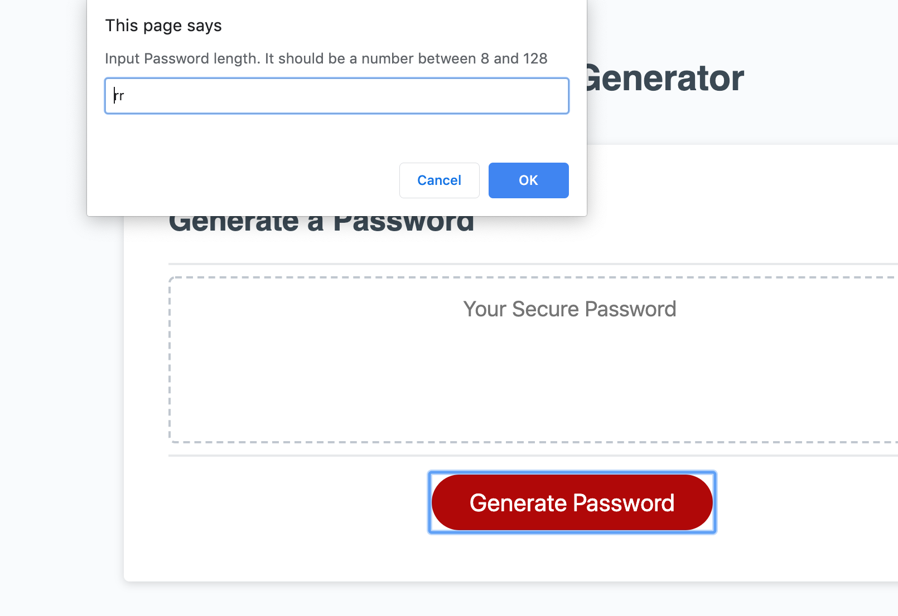
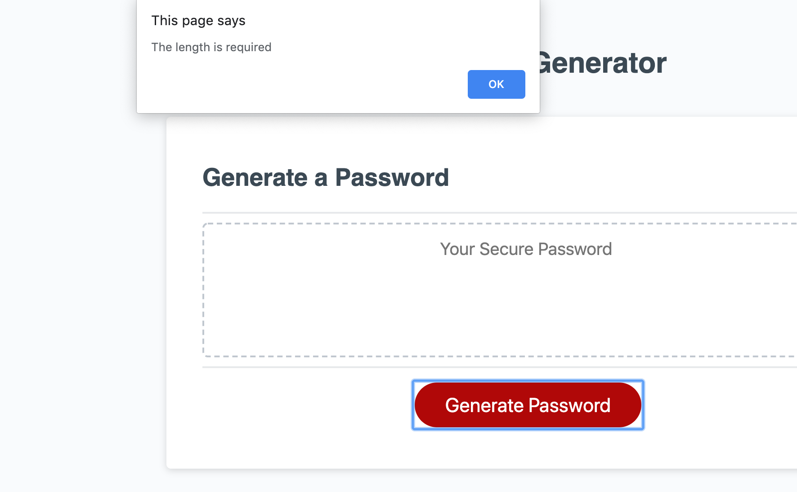
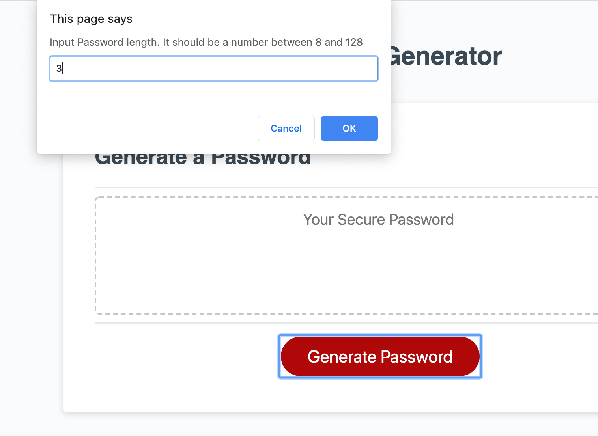
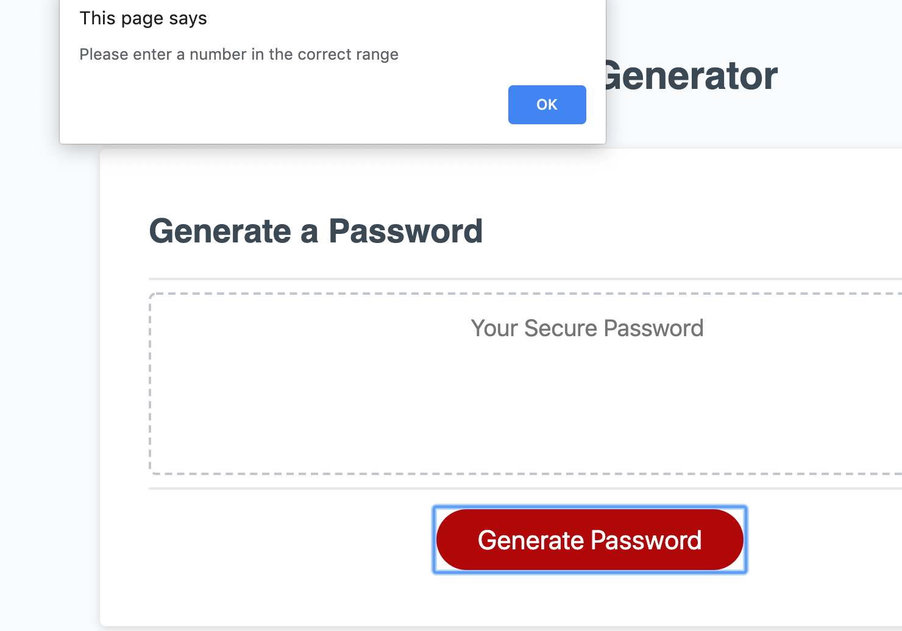
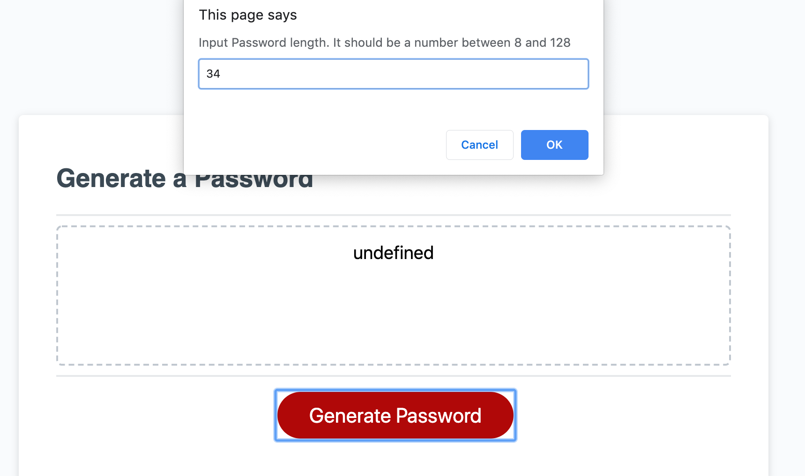
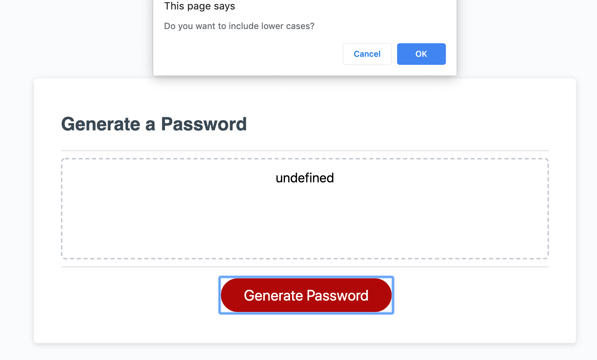
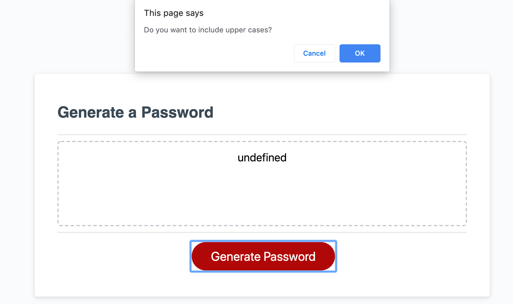
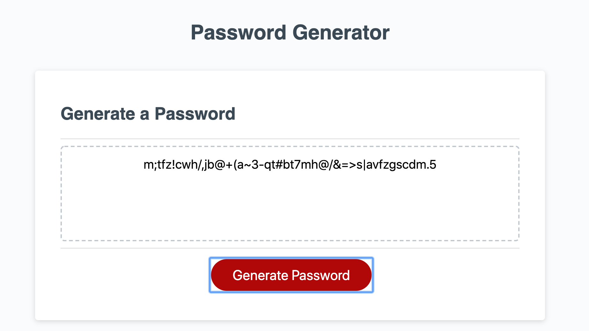

# PassWord Generator

It is an application that generates a random password based on user-selected criteria. It runs in the browser and feature dynamically updated HTML and CSS powered by your JavaScript code. The user activates a function to generate a password which is of the length of his choice and includes, as the user choose through a series of prompts, either a lower case or an upper case letter, a numeric number or a special character.
The generated password is displayed on a text area in the user's interface.

The link to the deployed application is: 
.

For each of the scenario below, click on the picture links to view the screenshots:

scenario 1:
User mistakenly input a wrong type of character, not a number, as password length. 

scenario 2:
User gives a number not within specified range  as password length.

scenario 3:
User input a password length within range - 34- when prompted.  Here we have screen shots of options including the 4 characters types combinations - all 4, only 3, only 2 and one type.

